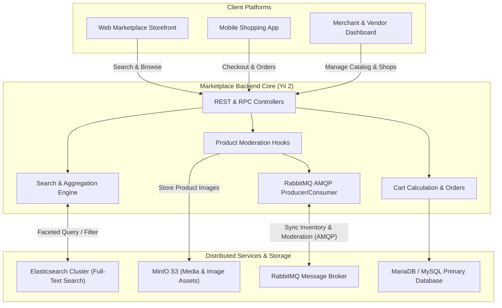

# 🛒 E-Commerce Multi-Vendor Marketplace Core Engine & API

<p align="center">
  
  
  
  
  
  
</p>

A high-throughput, enterprise-scale **Multi-Vendor E-Commerce Marketplace Backend** built with Yii 2, Elasticsearch, RabbitMQ (AMQP), and MinIO (S3-compatible Object Storage). The core engine orchestrates large-scale product cataloging, sub-second faceted search, real-time inventory and price synchronization with external warehouse management systems (WMS), digital signature authentication, automated order workflows, and payment gateway webhooks.

---

## 🏛️ Architecture Overview

The marketplace acts as the central storefront and checkout engine, indexing hundreds of thousands of items into Elasticsearch and synchronizing inventory updates in real time via RabbitMQ.



---

## ✨ Key Technical Capabilities

### 1. High-Performance Elasticsearch Integration
- **Sub-Second Faceted Search**: Multi-attribute filtering (category, brand, color, price range, stock availability, ratings).
- **Automated Index Lifecycle**: Console automation via `ensure-reindex` commands for atomic zero-downtime index swapping and mapping updates.
- **Aggregations & Suggestions**: Instant search suggestion tokens and faceted count computations across massive SKU sets.

### 2. Event-Driven Inventory & Catalog Synchronization (RabbitMQ)
- **Bidirectional AMQP Event Bus**: Replaced traditional blocking HTTP polling with asynchronous queue consumers and producers.
- **Stock & Catalog Consistency**: Real-time consumption of stock level changes, price modifications, and new arrival events from warehouse fulfillment systems.
- **Moderation Workflow Hooks**: Automated status publishing when merchant products pass review, triggering immediate availability across consumer storefronts.

### 3. MinIO S3-Compatible Media Infrastructure
- Cloud-native media management handling high-volume product gallery uploads, variant thumbnails, and merchant verification documents.
- CDN-friendly signed URLs and automatic MIME validation.

### 4. Advanced Checkout, Cart & Order Engine
- Complex multi-item pricing logic: Promotional discounts, tiered volume pricing, regional delivery calculation, and multi-vendor cart splitting.
- Resilient payment provider webhook integration with transactional idempotency guards.

### 5. Multi-Tenant Vendor & Shop Management
- Granular permissions (RBAC) separating Admins, Moderators, Merchants, and End-Users.
- Merchant onboarding pipeline with automated profile verification and digital contract signing.

---

## 🚀 Key API Endpoints (Excerpt)

| Module | Method | Endpoint | Description |
|---|---|---|---|
| **Catalog** | `GET` | `/v1/products` | Paginated product listing with Elasticsearch query parameters |
| **Catalog** | `GET` | `/v1/products/{id}` | Product detail with variants, gallery, and merchant info |
| **Search** | `GET` | `/v1/search` | Full-text search with faceted aggregations |
| **Cart** | `POST` | `/v1/cart/add` | Add item to cart with variant selections |
| **Cart** | `POST` | `/v1/cart/calculate` | Recalculate totals, delivery fees, and discounts |
| **Orders** | `POST` | `/v1/orders` | Place new customer order |
| **Merchant** | `POST` | `/v1/merchant/products` | Create product draft for moderation |
| **Sync** | `POST` | `/v1/sync/stock` | Webhook endpoint for inbound stock level sync |
| **Health** | `GET` | `/v1/health` | Liveness and readiness probes |

---

## 🛠️ Tech Stack

- **Backend Framework**: Yii 2 Framework (PHP 8.1+)
- **Search Engine**: Elasticsearch 7.x / 8.x
- **Message Broker**: RabbitMQ 3.12+ (AMQP)
- **Object Storage**: MinIO S3 Compatible Storage
- **Primary Database**: MariaDB 10.5+ / MySQL 8.0+
- **Caching**: Redis 7.x
- **Containerization**: Docker & Docker Compose

---

## ⚙️ Getting Started

### Prerequisites
- Docker & Docker Compose
- PHP 8.1+ & Composer (optional, for non-dockerized execution)

### 1. Clone the repository
```bash
git clone git@github.com:abdullayevbahrom/ecommerce-marketplace-core-api.git
cd ecommerce-marketplace-core-api
```

### 2. Configure Environment
```bash
cp config/params.php.example config/params.php
```

Configure Elasticsearch and RabbitMQ hosts:
```php
'elasticsearch' => [
    'hosts' => ['http://elasticsearch:9200'],
],
'rabbitmq' => [
    'host' => 'rabbitmq',
    'port' => 5672,
    'user' => 'guest',
    'password' => 'guest',
],
```

### 3. Run via Docker Compose
```bash
docker compose up -d --build
docker compose exec app php yii migrate --interactive=0
```

### 4. Initialize Elasticsearch Index
```bash
docker compose exec app php yii elasticsearch/ensure-reindex
```

The Marketplace API will be available at `http://localhost:8000`.

---

## 👤 Author

**Bahrom Abdullayev**  
- GitHub: [@abdullayevbahrom](https://github.com/abdullayevbahrom)  
- Role: Backend Engineer & System Architect

---

## 📄 License
This project is open-sourced under the [MIT License](LICENSE).
